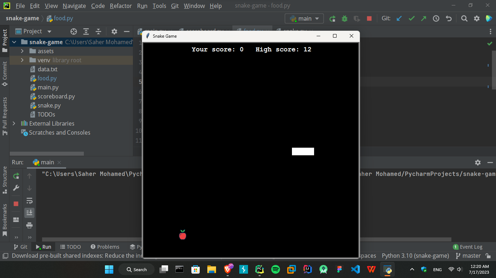
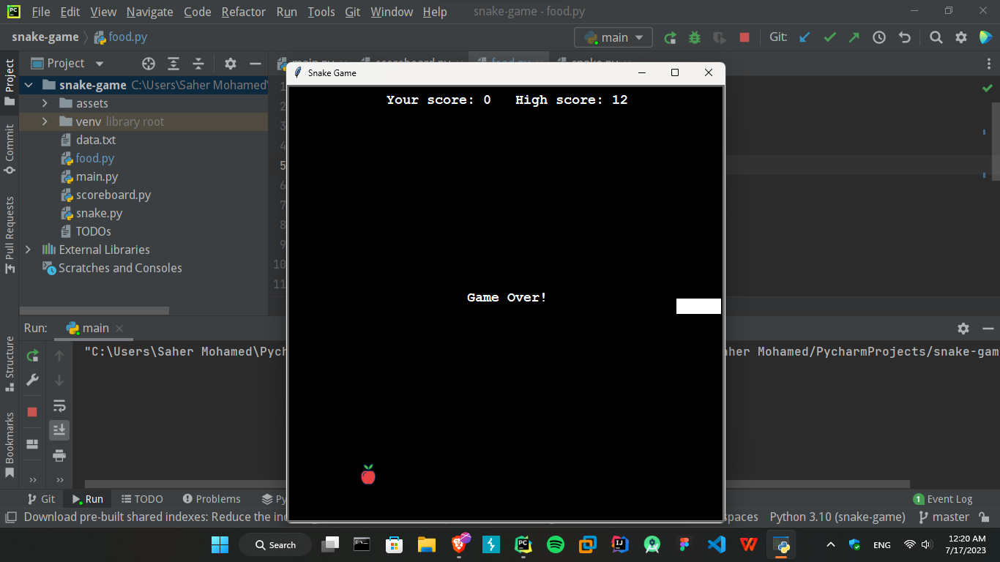

# Snake Game
This is a simple Snake game implemented in Python using the Turtle module. The objective of the game is to control a snake and eat the food while avoiding collisions with walls and the snake's own tail.

## Prerequisites
Make sure you have Python installed on your system. This game was developed and tested using Python 3.9.

## Installation
1. Clone or download the project files to your local machine.
2. Open a terminal or command prompt and navigate to the project directory.
3. Run the following command to install the required dependencies:
    ```commandline
    pip install -r requirements.txt
    ```

## Screenshots



## Gameplay Instructions
- Use the arrow keys (Up, Down, Left, Right) to control the snake's movement.
- The snake will move one step in the chosen direction with each arrow key press.
- The objective is to eat the food (represented by a red apple) that appears on the screen.
- Each time the snake eats the food, its length will increase, and the score will be updated.
- Avoid colliding with the walls or the snake's own tail, as this will end the game.
- The game will display your current score and the highest score achieved so far.

## Features
- Smooth and responsive controls using arrow keys.
- Randomly generated food for the snake to eat.
- Score tracking and display of the highest score.
- Game over screen with the final score.
